# Magector

**Semantic code search engine for Magento 2 and Adobe Commerce, powered by ONNX embeddings and HNSW vector search.**

Magector indexes an entire Magento 2 or Adobe Commerce codebase and lets you search it with natural language. Instead of grepping for keywords, ask questions like *"how are checkout totals calculated?"* or *"where is the product price determined?"* and get ranked, relevant results in under 50ms.

[](https://www.rust-lang.org)
[](https://nodejs.org)
[](https://magento.com)
[](https://business.adobe.com/products/magento/magento-commerce.html)
[](#validation)
[](LICENSE)

---

## Why Magector

Magento 2 and Adobe Commerce have **18,000+ PHP, XML, JS, PHTML, and GraphQL files** spread across hundreds of modules. The codebase relies heavily on indirection — plugins intercept methods defined in other modules, observers react to events dispatched elsewhere, `di.xml` rewires interfaces to concrete classes, and layout XML stitches blocks and templates together. No single file tells the full story.

Traditional search tools don't help much here:

- **`grep` / `ripgrep`** finds literal strings but can't connect *"how does checkout calculate totals?"* to `TotalsCollector.php` — the word "totals" appears in hundreds of unrelated files.
- **IDE search** requires you to already know the class or method name. If you're exploring unfamiliar territory (most Magento work), you're guessing.
- **AI code assistants** (Claude Code, Cursor) use grep internally. On an 18K-file codebase they burn tokens reading dozens of wrong files before finding the right ones — if they find them at all.

Magector solves this by building a **semantic vector index** of the entire codebase. Every file is embedded into a 384-dimensional space where meaning matters more than keywords. A search for *"payment capture"* returns `Sales/Model/Order/Payment/Operations/CaptureOperation.php` because the embeddings are close — not because the file contains the word "capture". On top of that, Magento-specific pattern detection (plugins, observers, controllers, blocks, cron jobs, etc.) enriches every result so the AI client knows *what kind* of code it's looking at.

| Approach | Finds semantic matches | Understands Magento patterns | Speed (18K files) |
|----------|:---------------------:|:---------------------------:|:-----------------:|
| `grep` / `ripgrep` | No | No | 100-500ms |
| IDE search | No | No | 200-1000ms |
| GitHub search | Partial | No | 500-2000ms |
| **Magector** | **Yes** | **Yes** | **10-45ms** |

---

## Magector vs Built-in AI Search

Claude Code and Cursor both have built-in code search, but they rely on keyword matching (`grep`/`ripgrep`) and file-tree heuristics. That works for small projects. On a Magento codebase with 18,000+ files and deep indirection (plugins, observers, DI preferences, layout XML), keyword search returns noise — the AI reads dozens of wrong files, burns context tokens, and often still misses the answer.

| Capability | Claude Code / Cursor (built-in) | Magector |
|---|---|---|
| **Search method** | Keyword grep / ripgrep | Semantic vector search (ONNX embeddings) |
| **Understands intent** | No -- literal string matching only | Yes -- "payment capture" finds `CaptureOperation.php` |
| **Magento pattern awareness** | None -- treats all PHP the same | Detects controllers, plugins, observers, blocks, resolvers, cron, and 20+ patterns |
| **Query speed (36K vectors)** | 200-1000ms per grep pass; multiple rounds needed | 10-45ms single pass |
| **Context window cost** | Reads many wrong files, burns tokens | Returns structured JSON with ranked results, methods, and snippets |
| **Learns from usage** | No | Yes -- SONA tracks which results you actually use and adjusts future rankings |
| **Works offline** | Yes | Yes -- local ONNX model, no API calls |
| **Setup** | Built-in | `npx magector init` (one command) |

### What this means in practice

Without Magector, asking Claude Code or Cursor *"how are checkout totals calculated?"* triggers multiple grep searches, reads dozens of files, and still may miss the right ones. With Magector, the AI calls `magento_search("checkout totals calculation")` and gets the exact files ranked by relevance in one step — saving tokens and time.

**Magector doesn't replace your AI tool — it gives it a search engine that understands Magento.**

---

## Features

- **Semantic search** -- find code by meaning, not exact keywords
- **99.2% accuracy** -- validated with 101 E2E test queries across 16 tool categories, plus 557 Rust-level test cases
- **Hybrid search** -- combines semantic vector similarity with keyword re-ranking for best-of-both-worlds results
- **Structured JSON output** -- results include file path, class name, methods list, role badges, and content snippets for minimal round-trips
- **Persistent serve mode** -- keeps ONNX model and HNSW index resident in memory, eliminating cold-start latency
- **Incremental re-indexing** -- background file watcher detects changes and updates the index without restart (tombstone + compact strategy)
- **ONNX embeddings** -- native 384-dim transformer embeddings via ONNX Runtime
- **36K+ vectors** -- indexes the complete Magento 2 / Adobe Commerce codebase including framework internals
- **Magento-aware** -- understands controllers, plugins, observers, blocks, resolvers, repositories, and 20+ Magento patterns
- **Adobe Commerce compatible** -- works with both Magento Open Source and Adobe Commerce (B2B, Staging, and all Commerce-specific modules)
- **AST-powered** -- tree-sitter parsing for PHP and JavaScript extracts classes, methods, namespaces, and inheritance
- **Cross-tool discovery** -- tool descriptions include keywords and "See also" references so AI clients find the right tool on the first try
- **SONA feedback learning** -- self-adjusting search that learns from MCP tool call patterns (e.g., search → find_plugin refines future rankings for similar queries)
- **SONA v2 with MicroLoRA + EWC++** -- rank-2 low-rank adapter (1536 params, ~6KB) adjusts query embeddings based on learned patterns; Elastic Weight Consolidation prevents catastrophic forgetting during online learning
- **Diff analysis** -- risk scoring and change classification for git commits and staged changes
- **Complexity analysis** -- cyclomatic complexity, function count, and hotspot detection across modules
- **Fast** -- 10-45ms queries via persistent serve process, batched ONNX embedding with adaptive thread scaling
- **MCP server** -- 20 tools integrating with Claude Code, Cursor, and any MCP-compatible AI tool
- **Clean architecture** -- Rust core handles all indexing/search, Node.js MCP server delegates to it

---

## Architecture

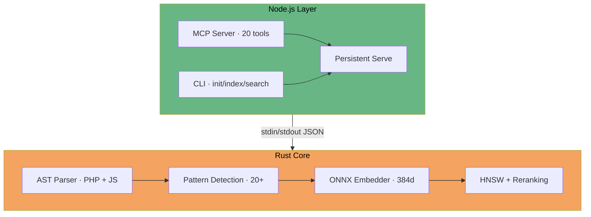

### Indexing Pipeline

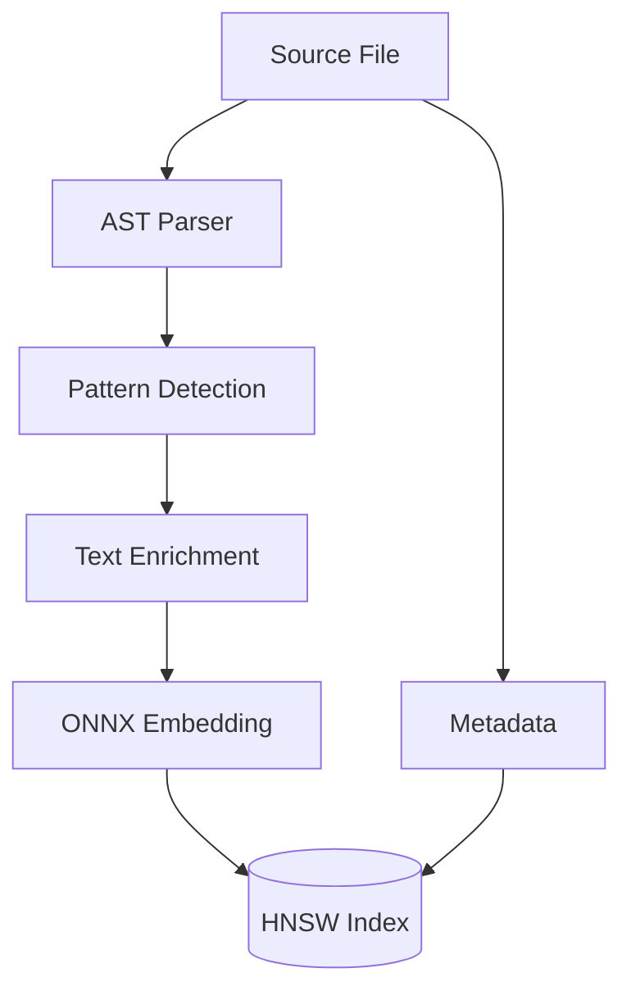

### Search Pipeline

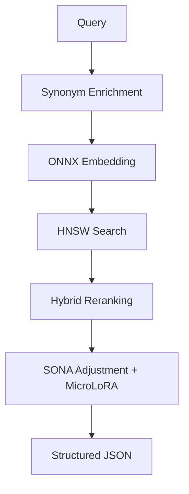

### Components

| Component | Technology | Purpose |
|-----------|-----------|---------|
| Embeddings | `ort` (ONNX Runtime) | all-MiniLM-L6-v2, 384 dimensions |
| Vector search | `hnsw_rs` + hybrid reranking | Approximate nearest neighbor + keyword boosting |
| PHP parsing | `tree-sitter-php` | Class, method, namespace extraction |
| JS parsing | `tree-sitter-javascript` | AMD/ES6 module detection |
| Pattern detection | Custom Rust | 20+ Magento-specific patterns |
| CLI | `clap` | Command-line interface (index, search, serve, validate) |
| SONA | Custom Rust | Feedback learning with MicroLoRA + EWC++ |
| MCP server | `@modelcontextprotocol/sdk` | AI tool integration with structured JSON output |

---

## Quick Start

### Prerequisites

- [Node.js 18+](https://nodejs.org)

### 1. Initialize in Your Project

```bash
cd /path/to/your/magento2  # or Adobe Commerce project
npx magector init
```

This single command handles the entire setup:

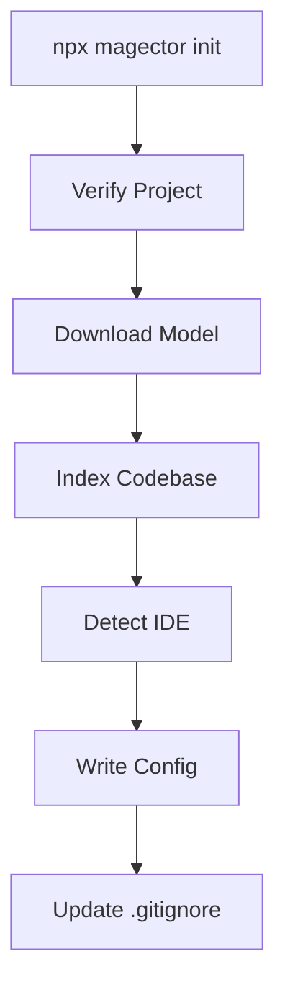

### 2. Search

```bash
npx magector search "product price calculation"
npx magector search "checkout totals collector" -l 20
```

### 3. Re-index After Changes

```bash
npx magector index
```

### 4. IDE Setup Only (Skip Indexing)

```bash
npx magector setup
```

---

## CLI Reference

### Rust Core CLI

```
magector-core <COMMAND>

Commands:
  index       Index a Magento codebase
  search      Search the index semantically
  serve       Start persistent server mode (stdin/stdout JSON protocol)
  validate    Run validation suite (downloads Magento if needed)
  download    Download Magento 2 Open Source
  stats       Show index statistics
  embed       Generate embedding for text
```

#### `index`

```bash
magector-core index [OPTIONS]

Options:
  -m, --magento-root <PATH>   Path to Magento root directory
  -d, --database <PATH>       Index database path [default: ./magector.db]
  -c, --model-cache <PATH>    Model cache directory [default: ./models]
  -v, --verbose               Enable verbose output
```

#### `search`

```bash
magector-core search <QUERY> [OPTIONS]

Options:
  -d, --database <PATH>   Index database path [default: ./magector.db]
  -l, --limit <N>         Number of results [default: 10]
  -f, --format <FORMAT>   Output format: text, json [default: text]
```

#### `serve`

```bash
magector-core serve [OPTIONS]

Options:
  -d, --database <PATH>       Index database path [default: ./magector.db]
  -c, --model-cache <PATH>    Model cache directory [default: ./models]
  -m, --magento-root <PATH>   Magento root (enables file watcher)
      --watch-interval <SECS> File watcher poll interval [default: 60]
```

Starts a persistent process that reads JSON queries from stdin and writes JSON responses to stdout. Keeps the ONNX model and HNSW index resident in memory for fast repeated queries.

When `--magento-root` is provided, a background file watcher polls for changed files every `--watch-interval` seconds and incrementally re-indexes them without restart. Modified and deleted files are soft-deleted (tombstoned) in the HNSW index; new vectors are appended. When tombstoned entries exceed 20% of total vectors, the index is automatically compacted by rebuilding the HNSW graph.

**Protocol (one JSON object per line):**

```json
// Request:
{"command":"search","query":"product price","limit":10}

// Response:
{"ok":true,"data":[{"id":123,"score":0.85,"metadata":{...}}]}

// Stats request:
{"command":"stats"}

// Watcher status:
{"command":"watcher_status"}
// Response:
{"ok":true,"data":{"running":true,"tracked_files":18234,"last_scan_changes":3,"interval_secs":60}}

// SONA feedback:
{"command":"feedback","signals":[{"type":"refinement_to_plugin","query":"checkout totals","timestamp":1700000000000}]}
// Response:
{"ok":true,"data":{"learned":1}}

// SONA status:
{"command":"sona_status"}
// Response:
{"ok":true,"data":{"learned_patterns":5,"total_observations":12}}

```

### Node.js CLI

```bash
npx magector init [path]        # Full setup: index + IDE config
npx magector index [path]       # Index (or re-index) Magento codebase
npx magector search <query>     # Search indexed code
npx magector stats              # Show indexer statistics
npx magector setup [path]       # IDE setup only (no indexing)
npx magector mcp                # Start MCP server
npx magector help               # Show help
```

### Environment Variables

| Variable | Description | Default |
|----------|-------------|---------|
| `MAGENTO_ROOT` | Path to Magento installation | Current directory |
| `MAGECTOR_DB` | Path to index database | `./magector.db` |
| `MAGECTOR_BIN` | Path to magector-core binary | Auto-detected |
| `MAGECTOR_MODELS` | Path to ONNX model directory | `~/.magector/models/` |

---

## MCP Server Tools

The MCP server exposes 20 tools for AI-assisted Magento 2 and Adobe Commerce development. All search tools return **structured JSON** with file paths, class names, methods, role badges, and content snippets -- enabling AI clients to parse results programmatically and minimize file-read round-trips.

### Output Format

All search tools return structured JSON:

```json
{
  "results": [
    {
      "rank": 1,
      "score": 0.892,
      "path": "vendor/magento/module-catalog/Model/ProductRepository.php",
      "module": "Magento_Catalog",
      "className": "ProductRepository",
      "namespace": "Magento\\Catalog\\Model",
      "methods": ["save", "getById", "getList", "delete", "deleteById"],
      "magentoType": "repository",
      "fileType": "php",
      "badges": ["repository"],
      "snippet": "class ProductRepository implements ProductRepositoryInterface..."
    }
  ],
  "count": 1
}
```

**Key fields:**
- `methods` -- list of method names in the class (avoids needing to read the file)
- `badges` -- role indicators: `plugin`, `controller`, `observer`, `repository`, `graphql-resolver`, `model`, `block`
- `snippet` -- first 300 characters of indexed content for quick assessment

### Search Tools

| Tool | Description |
|------|-------------|
| `magento_search` | Semantic search -- find any PHP class, method, XML config, template, or GraphQL schema by natural language |
| `magento_find_class` | Find PHP class, interface, abstract class, or trait by name |
| `magento_find_method` | Find method implementations across the codebase |

### Magento-Specific Finders

| Tool | Description |
|------|-------------|
| `magento_find_config` | Find XML configuration (di.xml, events.xml, routes.xml, system.xml, webapi.xml, module.xml, layout) |
| `magento_find_template` | Find PHTML template files for frontend or admin rendering |
| `magento_find_plugin` | Find interceptor plugins (before/after/around methods) and di.xml declarations |
| `magento_find_observer` | Find event observers and events.xml declarations |
| `magento_find_preference` | Find DI preference overrides -- which class implements an interface |
| `magento_find_controller` | Find MVC controllers by frontend or admin route path |
| `magento_find_block` | Find Block classes for view rendering |
| `magento_find_graphql` | Find GraphQL schema definitions, resolvers, types, queries, and mutations |
| `magento_find_api` | Find REST/SOAP API endpoints in webapi.xml |
| `magento_find_cron` | Find cron job definitions in crontab.xml |
| `magento_find_db_schema` | Find database table definitions in db_schema.xml (declarative schema) |

### Flow Tracing

| Tool | Description |
|------|-------------|
| `magento_trace_flow` | Trace execution flow from an entry point (route, API, GraphQL, event, cron) -- maps controller → plugins → observers → templates in one call |

Auto-detects entry type from pattern (`/V1/...` → API, `snake_case` → event, `camelCase` → GraphQL, `path/segments` → route), or override with `entryType`. Use `depth: "shallow"` (entry + config + plugins) or `depth: "deep"` (adds observers, layout, templates, DI preferences).

### Analysis Tools

| Tool | Description |
|------|-------------|
| `magento_analyze_diff` | Analyze git diffs for risk scoring and change classification |
| `magento_complexity` | Analyze cyclomatic complexity, function count, and line count |

### Utility Tools

| Tool | Description |
|------|-------------|
| `magento_module_structure` | Show complete module structure -- controllers, models, blocks, plugins, observers, configs |
| `magento_index` | Trigger re-indexing of the codebase |
| `magento_stats` | View index statistics |

### Tool Cross-References

Each tool description includes "See also" hints to help AI clients chain tools effectively:

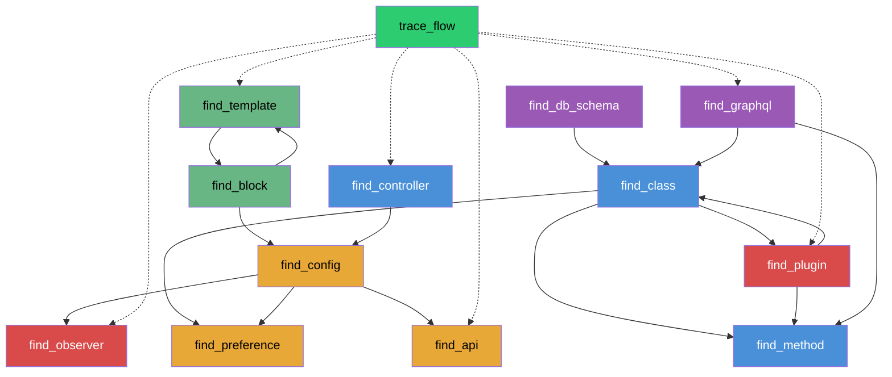

### Query Examples

```
magento_search("how are checkout totals calculated")
magento_search("product price with tier pricing and catalog rules")
magento_find_class("ProductRepositoryInterface")
magento_find_method("getById")
magento_find_config("di.xml plugin for ProductRepository")
magento_find_plugin({ targetClass: "Topmenu" })
magento_find_observer("sales_order_place_after")
magento_find_preference("StoreManagerInterface")
magento_find_api("/V1/orders")
magento_find_controller("catalog/product/view")
magento_find_graphql("placeOrder")
magento_find_db_schema("sales_order")
magento_find_cron("indexer")
magento_find_block("cart totals")
magento_find_template("minicart")
magento_analyze_diff({ commitHash: "abc123" })
magento_complexity({ module: "Magento_Catalog", threshold: 10 })
magento_trace_flow({ entryPoint: "checkout/cart/add", depth: "deep" })
magento_trace_flow({ entryPoint: "/V1/products" })
magento_trace_flow({ entryPoint: "placeOrder", entryType: "graphql" })
magento_trace_flow({ entryPoint: "sales_order_place_after" })
```

---

## Supported Platforms

Pre-built binaries are provided for the following platforms:

| Platform | Architecture | Package |
|----------|-------------|---------|
| macOS | ARM64 (Apple Silicon) | `@magector/cli-darwin-arm64` |
| Linux | x86_64 | `@magector/cli-linux-x64` |
| Linux | ARM64 | `@magector/cli-linux-arm64` |
| Windows | x86_64 | `@magector/cli-win32-x64` |

> **Note:** macOS Intel (x86_64) is not supported as a pre-built binary. Intel Mac users can [build from source](#building-from-source).

---

## Validation

Magector is validated at two levels:

1. **E2E MCP accuracy tests** -- 101 queries across 16 tool categories via stdio JSON-RPC
2. **Rust-level validation** -- 557 test cases across 50+ categories against Magento 2.4.7

### E2E Accuracy (MCP Tools)

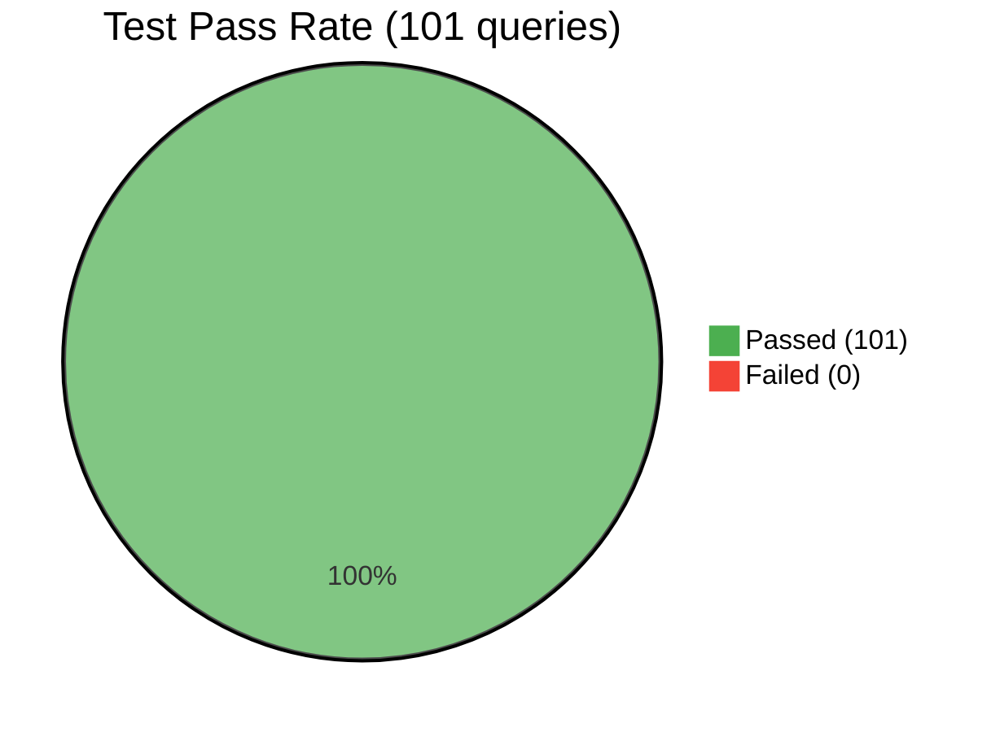

| Metric | Value |
|--------|-------|
| **Grade** | **A+ (99.2/100)** |
| **Pass rate** | 101/101 (100%) |
| **Precision** | 98.7% |
| **MRR** | 99.3% |
| **NDCG@10** | 98.7% |
| **Index size** | 35,795 vectors |
| **Query time** | 10-45ms |

### Integration Tests

64 integration tests covering MCP protocol compliance, tool schemas, tool calls, analysis tools, and stdout JSON integrity.

### Running Tests

```bash
# E2E accuracy tests (101 queries, requires indexed codebase)
npm run test:accuracy
npm run test:accuracy:verbose

# Integration tests (64 tests)
npm test

# SONA/MicroLoRA benefit evaluation (180 queries, baseline vs post-training)
npm run test:sona-eval
npm run test:sona-eval:verbose

# Rust validation (557 test cases)
cd rust-core && cargo run --release -- validate -m ./magento2 --skip-index
```

---

## Project Structure

```
magector/
├── src/                          # Node.js source
│   ├── cli.js                    # CLI entry point (npx magector <command>)
│   ├── mcp-server.js             # MCP server (20 tools, structured JSON output)
│   ├── binary.js                 # Platform binary resolver
│   ├── model.js                  # ONNX model resolver/downloader
│   ├── init.js                   # Full init command (index + IDE config)
│   ├── magento-patterns.js       # Magento pattern detection (JS)
│   ├── templates/                # IDE rules templates
│   │   ├── cursorrules.js        # .cursorrules content
│   │   └── claude-md.js          # CLAUDE.md content
│   └── validation/               # JS validation suite
│       ├── validator.js
│       ├── benchmark.js
│       ├── test-queries.js
│       ├── test-data-generator.js
│       └── accuracy-calculator.js
├── tests/                        # Automated tests
│   ├── mcp-server.test.js        # Integration tests (64 tests)
│   ├── mcp-accuracy.test.js      # E2E accuracy tests (101 queries)
│   ├── mcp-sona.test.js          # SONA feedback integration tests (8 tests)
│   ├── mcp-sona-eval.test.js     # SONA/MicroLoRA benefit evaluation (180 queries)
│   └── results/                  # Test result artifacts
│       ├── accuracy-report.json
│       └── sona-eval-report.json
├── platforms/                    # Platform-specific binary packages
│   ├── darwin-arm64/             # macOS ARM (Apple Silicon)
│   ├── linux-x64/                # Linux x64
│   ├── linux-arm64/              # Linux ARM64
│   └── win32-x64/                # Windows x64
├── rust-core/                    # Rust high-performance core
│   ├── Cargo.toml
│   ├── src/
│   │   ├── main.rs               # Rust CLI (index, search, serve, validate)
│   │   ├── lib.rs                # Library exports
│   │   ├── indexer.rs             # Core indexing with progress output
│   │   ├── embedder.rs            # ONNX embedding (MiniLM-L6-v2)
│   │   ├── vectordb.rs            # HNSW vector database + hybrid search + tombstones
│   │   ├── watcher.rs             # File watcher for incremental re-indexing
│   │   ├── ast.rs                 # Tree-sitter AST (PHP + JS)
│   │   ├── magento.rs             # Magento pattern detection (Rust)
│   │   ├── sona.rs                # SONA feedback learning + MicroLoRA + EWC++
│   │   └── validation.rs          # 557 test cases, validation framework
│   └── models/                   # ONNX model files (auto-downloaded)
│       ├── all-MiniLM-L6-v2.onnx
│       └── tokenizer.json
├── .github/
│   └── workflows/
│       └── release.yml           # Cross-compile + publish CI
├── scripts/
│   └── setup.sh                  # Claude Code MCP setup script
├── config/
│   └── mcp-config.json           # MCP server configuration template
├── package.json
├── .gitignore
├── LICENSE
└── README.md
```

---

## How It Works

### 1. Indexing

Magector scans every `.php`, `.js`, `.xml`, `.phtml`, and `.graphqls` file in a Magento 2 or Adobe Commerce codebase:

1. **AST parsing** -- Tree-sitter extracts class names, namespaces, methods, inheritance, and interface implementations from PHP and JavaScript files
2. **Pattern detection** -- Identifies Magento-specific patterns: controllers, models, repositories, plugins, observers, blocks, GraphQL resolvers, admin grids, cron jobs, and more
3. **Search text enrichment** -- Combines AST metadata with Magento pattern keywords to create semantically rich text representations
4. **Embedding** -- ONNX Runtime generates 384-dimensional vectors using all-MiniLM-L6-v2
5. **Indexing** -- Vectors are stored in an HNSW index for sub-millisecond approximate nearest neighbor search

### 2. Searching

1. Query text is enriched with pattern synonyms (e.g., "controller" adds "action execute http request dispatch")
2. The enriched query is embedded into the same 384-dimensional vector space
3. HNSW finds the nearest neighbors by cosine similarity
4. **Hybrid reranking** boosts results with keyword matches in path and search text
5. **SONA adjustment** -- MicroLoRA adapts the query embedding based on learned patterns; EWC++ prevents forgetting earlier learning
6. Results are returned as structured JSON with file path, class name, methods, role badges, and content snippet

### 3. Persistent Serve Mode

The MCP server spawns a persistent Rust process (`magector-core serve`) that keeps the ONNX model and HNSW index loaded in memory. Queries are sent as JSON over stdin and responses returned via stdout -- eliminating the ~2.6s cold-start overhead of loading the model per query. Falls back to single-shot `execFileSync` if the serve process is unavailable.

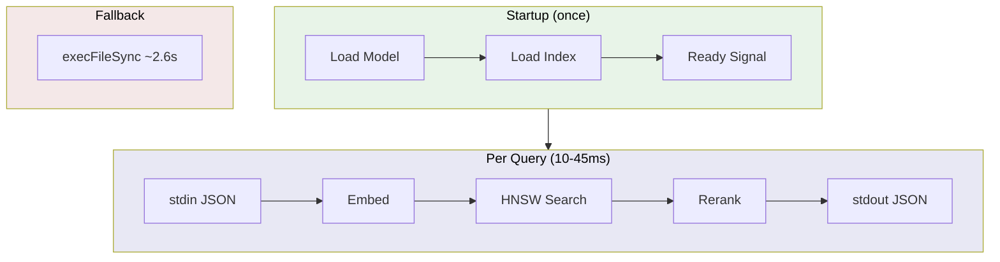

### 4. File Watcher (Incremental Re-indexing)

When the serve process is started with `--magento-root`, a background thread polls the filesystem for changes every 60 seconds (configurable via `--watch-interval`). Changed files are incrementally re-indexed without restarting the server.

Since `hnsw_rs` does not support point deletion, Magector uses a **tombstone** strategy: old vectors for modified/deleted files are marked as tombstoned and filtered out of search results. New vectors are appended. When tombstoned entries exceed 20% of total vectors, the HNSW graph is automatically rebuilt (compacted) to reclaim memory and restore search performance.

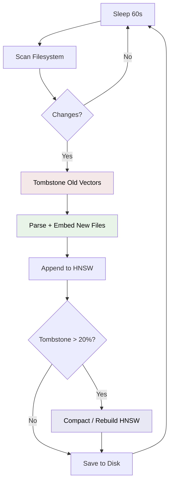

### 5. MCP Integration

The MCP server delegates all search/index operations to the Rust core binary. Analysis tools (diff, complexity) use ruvector JS modules directly.

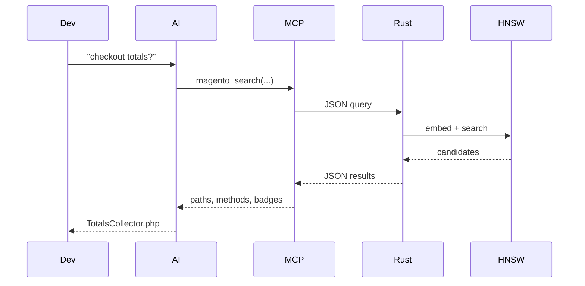

### 6. SONA Feedback Learning

The MCP server tracks sequences of tool calls and sends feedback signals to the Rust process. Over time, this adjusts search result rankings based on observed usage patterns.

**How it works:** The Node.js `SessionTracker` watches for follow-up tool calls after `magento_search`. If a user searches and then immediately calls `magento_find_plugin`, SONA learns that similar queries should boost plugin results. The learned weights are persisted to a `.sona` file alongside the index.

| MCP Call Sequence | Signal | Effect on Future Searches |
|---|---|---|
| `magento_search` → `magento_find_plugin` (within 30s) | `refinement_to_plugin` | Boosts plugin results |
| `magento_search` → `magento_find_class` (within 30s) | `refinement_to_class` | Boosts class matches |
| `magento_search` → `magento_find_config` (within 30s) | `refinement_to_config` | Boosts config/XML results |
| `magento_search` → `magento_find_observer` (within 30s) | `refinement_to_observer` | Boosts observer results |
| `magento_search` → `magento_find_controller` (within 30s) | `refinement_to_controller` | Boosts controller results |
| `magento_search` → `magento_find_block` (within 30s) | `refinement_to_block` | Boosts block results |
| `magento_search` → `magento_trace_flow` (within 30s) | `trace_after_search` | Boosts controller results |
| `magento_search(Q1)` → `magento_search(Q2)` (within 60s) | `query_refinement` | Tracked for analysis |

**Characteristics:**
- Score adjustments are capped at ±0.15 to avoid overwhelming semantic similarity
- Learning rate decays with repeated observations (diminishing returns)
- Learned weights are keyed by normalized, order-independent query term hashes
- Always active -- no feature flags or build-time opt-in required
- Persisted via bincode to `<db_path>.sona`

**SONA v2: MicroLoRA + EWC++**

SONA v2 adds embedding-level adaptation via a MicroLoRA adapter and Elastic Weight Consolidation:

| Component | Parameters | Purpose |
|-----------|-----------|---------|
| MicroLoRA | 1536 (rank-2, 2×384×2) | Adjusts query embeddings before HNSW search |
| EWC++ | Fisher matrix (384 values) | Prevents catastrophic forgetting during online learning |

- `adjust_query_embedding()` applies the LoRA transform + L2 normalization before vector search; cosine similarity guard (≥0.90) skips destructive adjustments
- `learn_with_embeddings()` updates LoRA weights from feedback signals with EWC regularization (λ=2000) and decaying learning rate
- 3-tier scoring with negative learning: positive signals boost the followed feature type, mild negative learning (0.1×) demotes unrelated types
- V1→V2 persistence format is backward-compatible (auto-upgrades on load)

```bash
cd rust-core && cargo build --release
```

---

## Magento Patterns Detected

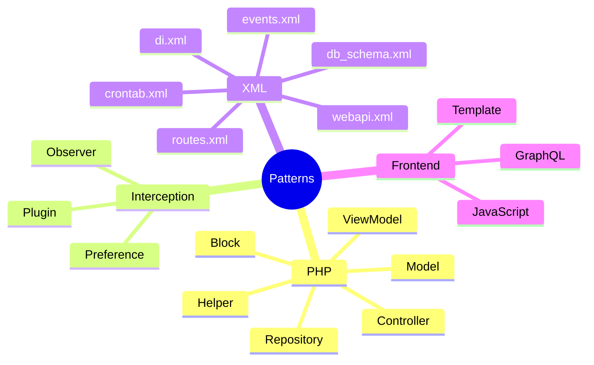

Magector understands these Magento 2 architectural patterns:

| Pattern | Detection Method | Example |
|---------|-----------------|---------|
| Controller | Path + `execute()` method | `Controller/Adminhtml/Order/View.php` |
| Model | Path + extends `AbstractModel` | `Model/Product.php` |
| Repository | Path + implements `RepositoryInterface` | `Model/ProductRepository.php` |
| Block | Path + extends `AbstractBlock` | `Block/Product/View.php` |
| Plugin | Path + before/after/around methods | `Plugin/Product/SavePlugin.php` |
| Observer | Path + implements `ObserverInterface` | `Observer/ProductSaveObserver.php` |
| GraphQL Resolver | Path + implements `ResolverInterface` | `Model/Resolver/Products.php` |
| Helper | Path under `Helper/` | `Helper/Data.php` |
| Cron | Path under `Cron/` | `Cron/CleanExpiredQuotes.php` |
| Console Command | Path + extends `Command` | `Console/Command/IndexerReindex.php` |
| Data Provider | Path + `DataProvider` | `Ui/DataProvider/Product/Listing.php` |
| ViewModel | Path + implements `ArgumentInterface` | `ViewModel/Product/Breadcrumbs.php` |
| Setup Patch | Path + `Patch/Data` or `Patch/Schema` | `Setup/Patch/Data/AddAttribute.php` |
| di.xml | Path matching | `etc/di.xml`, `etc/frontend/di.xml` |
| events.xml | Path matching | `etc/events.xml` |
| webapi.xml | Path matching | `etc/webapi.xml` |
| layout XML | Path under `layout/` | `view/frontend/layout/catalog_product_view.xml` |
| Template | `.phtml` extension | `view/frontend/templates/product/view.phtml` |
| JavaScript | `.js` with AMD/ES6 detection | `view/frontend/web/js/view/minicart.js` |
| GraphQL Schema | `.graphqls` extension | `etc/schema.graphqls` |

---

## Configuration

### Cursor IDE Rules

Copy `.cursorrules` to your Magento project root for optimized AI-assisted development. The rules instruct the AI to:

1. Use Magector MCP tools before reading files manually
2. Write effective semantic queries
3. Follow Magento development patterns
4. Interpret search results correctly

### Model Configuration

The ONNX model (`all-MiniLM-L6-v2`) is automatically downloaded on first run to `~/.magector/models/`. To use a different location:

```bash
magector-core index -m /path/to/magento -c /custom/model/path
```

---

## Development

### Building from Source

```bash
git clone https://github.com/krejcif/magector.git
cd magector

# Install Node.js dependencies
npm install

# Build the Rust core
cd rust-core
cargo build --release
cd ..

# The CLI will automatically find the dev binary at rust-core/target/release/magector-core
node src/cli.js help
```

### Building

```bash
# Rust core
cd rust-core
cargo build --release

# Run unit tests
cargo test

# Run validation
cargo run --release -- validate
```

### Testing

```bash
# Integration tests (64 tests, requires indexed codebase)
npm test

# E2E accuracy tests (101 queries)
npm run test:accuracy
npm run test:accuracy:verbose

# Run without index (unit + schema tests only)
npm run test:no-index

# Rust unit tests (33 tests including SONA)
cd rust-core && cargo test

# SONA integration tests (8 tests)
node tests/mcp-sona.test.js

# SONA/MicroLoRA benefit evaluation (180 queries)
npm run test:sona-eval

# Rust validation (557 test cases)
cd rust-core && cargo run --release -- validate -m ./magento2 --skip-index
```

### Adding New Magento Patterns

1. Add pattern detection in `rust-core/src/magento.rs`
2. Add search text enrichment in `rust-core/src/indexer.rs`
3. Add validation test cases in `rust-core/src/validation.rs`
4. Add E2E accuracy test cases in `tests/mcp-accuracy.test.js`
5. Rebuild and run validation to verify:

```bash
cargo build --release
./target/release/magector-core validate -m ./magento2 --skip-index
npm run test:accuracy
```

### Adding MCP Tools

1. Define the tool schema in `src/mcp-server.js` (ListToolsRequestSchema handler)
2. Include keyword-rich descriptions and cross-tool "See also" references
3. Implement the handler in the CallToolRequestSchema handler
4. Return structured JSON via `formatSearchResults()`
5. Add E2E test cases in `tests/mcp-accuracy.test.js`
6. Test with Claude Code or the MCP inspector

---

## Technical Details

### Embedding Model

- **Model:** all-MiniLM-L6-v2
- **Dimensions:** 384
- **Pooling:** Mean pooling with attention mask
- **Normalization:** L2 normalized
- **Runtime:** ONNX Runtime (via `ort` crate)

### Vector Index

- **Algorithm:** HNSW (Hierarchical Navigable Small World)
- **Library:** `hnsw_rs`
- **Parameters:** M=32, max_layers=16, ef_construction=200
- **Distance metric:** Cosine similarity
- **Hybrid search:** Semantic nearest-neighbor + keyword reranking in path and search text + SONA/MicroLoRA feedback adjustments
- **Incremental updates:** Tombstone soft-delete + periodic HNSW rebuild (compact)
- **Persistence:** Bincode V2 binary serialization (backward-compatible with V1)

### Index Structure

Each indexed file produces a vector entry with metadata:

```rust
struct IndexMetadata {
    path: String,
    file_type: String,          // php, xml, js, template, graphql
    magento_type: String,       // controller, model, block, plugin, ...
    class_name: Option<String>,
    namespace: Option<String>,
    methods: Vec<String>,       // extracted method names
    search_text: String,        // enriched searchable text
    is_controller: bool,
    is_plugin: bool,
    is_observer: bool,
    is_model: bool,
    is_block: bool,
    is_repository: bool,
    is_resolver: bool,
    // ... 20+ pattern flags
}
```

### Performance Characteristics

| Operation | Time | Notes |
|-----------|------|-------|
| Full index (36K vectors) | ~1 min | Parallel parsing + batched ONNX embedding |
| Single query (warm) | 10-45ms | Persistent serve process, HNSW + rerank |
| Single query (cold) | ~2.6s | Includes ONNX model + index load |
| Embedding generation | ~2ms | ONNX Runtime with CoreML/CUDA |
| Batch embedding (32) | ~30ms | Batched ONNX inference |
| Model load | ~500ms | One-time at startup |
| Index save/load | <1s | Bincode binary serialization |

### Performance Optimizations

- **Persistent serve mode** -- Rust process keeps ONNX model + HNSW index in memory via stdin/stdout JSON protocol
- **Query cache** -- LRU cache (200 entries) avoids re-embedding identical queries
- **Hybrid reranking** -- combines semantic similarity with keyword matching for better precision
- **Batched ONNX embedding** -- 32 texts per inference call (vs. 1-at-a-time), 3-5x faster embedding
- **Dynamic thread scaling** -- ONNX intra-op threads scale to CPU core count
- **Thread-local AST parsers** -- each rayon thread gets its own tree-sitter parser (no mutex contention)
- **Bincode persistence** -- binary serialization replaces JSON (3-5x faster save/load, ~5x smaller files)
- **Adaptive HNSW capacity** -- pre-sized to actual vector count
- **Parallel HNSW insert** -- batch insert uses hnsw_rs parallel insertion on load and index
- **Tuned ef_search** -- optimized search parameters for 36K vector index (ef_search=50 for search, 64 for hybrid)
- **SONA feedback learning** -- learns from MCP tool call patterns to adjust search rankings; MicroLoRA adapts query embeddings, EWC++ prevents forgetting

---

## Roadmap

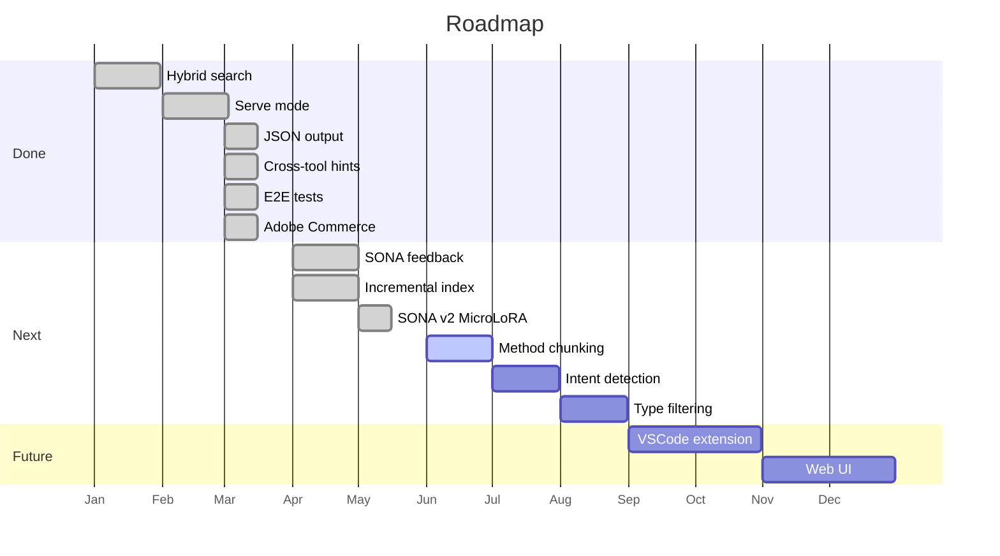

- [x] Hybrid search (semantic + keyword re-ranking)
- [x] Persistent serve mode (eliminates cold-start latency)
- [x] Structured JSON output (methods, badges, snippets)
- [x] Cross-tool discovery hints for AI clients
- [x] E2E accuracy test suite (101 queries)
- [x] Adobe Commerce support (B2B, Staging, and all Commerce-specific modules)
- [x] SONA feedback learning (search rankings adapt to MCP tool call patterns)
- [x] SONA v2 with MicroLoRA + EWC++ (embedding-level adaptation, prevents catastrophic forgetting)
- [ ] Method-level chunking (per-method vectors for direct method search)
- [ ] Query intent classification (auto-detect "give me XML" vs "give me PHP")
- [ ] Filtered search by file type at the vector level
- [x] Incremental indexing (background file watcher with tombstone + compact strategy)
- [ ] VSCode extension
- [ ] Web UI for browsing results

---

## License

MIT License. See [LICENSE](LICENSE) for details.

---

## Contributing

Contributions are welcome. Please:

1. Fork the repository
2. Create a feature branch (`git checkout -b feature/improvement`)
3. Add tests for new functionality
4. Run validation to ensure accuracy doesn't regress: `npm run test:accuracy`
5. Submit a pull request

---

Built with Rust and Node.js for the Magento and Adobe Commerce community.
